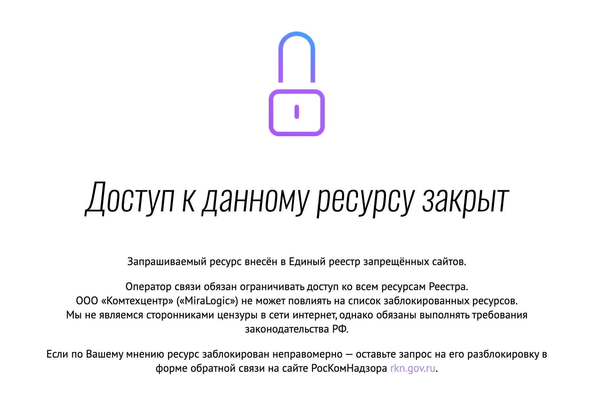
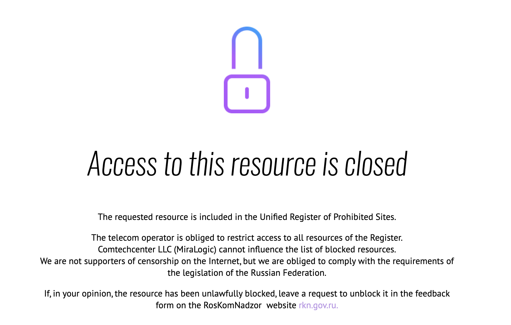

# Generate DNS blockpage fingerprint from Satellite v2 data
###### Code and notebooks for generating DNS blockpage fingerprints and other analysis





[Satellite v2](https://censoredplanet.org/projects) makes HTTP and HTTPS requests for IP that are marked as "anomaly" (or "ip mismatch") in the former stages (more detail please refer to the "Fetching HTML pages hosted at resolved IPs marked as an anomaly" part from the [documentation](https://github.com/censoredplanet/censoredplanet/issues/12)). 

Essentially, we fetch pages from the suspicious IPs requesting corresponding domains. We aim to identify TP fingerprints and TN fingerprints for blockpages. Former research paper has utilized [domain-centric single-link hierarchical clustering](https://conferences2.sigcomm.org/imc/2014/papers/p299.pdf), [iterative classification and image clustering](https://ensa.fi/papers/filtermap.pdf) and [clustering based on textual similarity and manually setting threshold](https://ieeexplore.ieee.org/stamp/stamp.jsp?tp=&arnumber=9152784). Our experiment shows that due to the nature of how satellite v2 collects pages - only sending out requests for suspicious `(ip, domain)` pair - using IP-centric similarity check yields best result.

## Heuristics

The intuitive behind it is simple: Censors poison or inject IP that do not host the legit website users ask for. Usually multiple domains in our test list will be resolved to IPs that host blockpages on them by censorous resolvers. The heuristics to select blockpage candidates are as follows:

1. We look into the pages that are successfully fetched for blockpage fingerprint generation. Note the IPs that actually host blockpages are only a subset of poisoned/injected IPs. 
2. We separate the pages into HTTP group and HTTPS group. In each group we separate the pages into subgroups based on their status code.
3. For 200+, 400+ and 500+ status code responses, we look into the pages returned by each IP. We cluster the pages based on length similarity or term frequency vector. If we see a uniformed outcome for `len(domain) > threshold`, we output  `(IP, domain_count, tld_count, page_length, similarity, example_page)` to the candidate file.
4. For 300+ status code responses (redirection), we check if the TLD (Top Level Domain) in `headers.Location` matches the TLD of the domain we sent requests for. For mismatch cases, we check if multiple domains (`len(domain) > threshold`) are redirected to the page with the same TLD and if so, we output  `(IP, domain_count, tld_count, page_length, similarity, example_page)` to the candidate file.

The heuristics come from to observation:

1. From satellite v2's blockpage data, no IP hosts both blockpages and legit pages in our `test_list`
2. Blockpages tend to have similar page length and contents. 

## Prerequisite 

To run the code, you will need access to the `firehook-censoredplanet` Google BigQuery. Alternatively you can parse the `blockpages.json` file from the satellite v2 raw data. You will need `python version >= 3.10` to run the code.

To install other prerequisite:

```
pip install -r requirements.txt
```

## Generate blockpage fingerprints

1. Modify `config.json` and run `scripts/main.py` to generate blockpage candidates (run `./check_format.sh` to format code).

2. Get data from `firehook-censoredplanet.laplante.satellite_blockpage_scan`. Modify `config.json` to set start time, end time and type (`HTTP` vs `HTTPS`):

   ```
   {
       "start_time": "2022-01-01",
       "end_time":"2022-01-04",
       "bq_org":"firehook-censoredplanet",
       "bq_table":"firehook-censoredplanet.laplante.satellite_blockpage_scan",
       "cluster_type":"length",
       "https_type": "True",
       "save_intermittent": "True",
       "read_file_logic": "2",
       "raw_table_loc":"blockpages_https_2022-01-01-2022-01-04.csv",
       "annotated_loc":"annotated_blockpages_2022-01-02_https.csv",
       "read_parsed_blockpages_from_local": "False",
       "false_positive_loc":"https://raw.githubusercontent.com/censoredplanet/assets-censoredplanet/master/false_positive_signatures.json",
       "blockpage_loc":"https://raw.githubusercontent.com/censoredplanet/assets-censoredplanet/master/blockpage_signatures.json",
       "similarity_threshold": "0.2",
       "tld_threshold": "5"
   }
   ```

   Because fetching blockpages from BQ and finding matching TP/FP fingerprints from existing resources can be time consuming, we provide the optional to save and intermittent files and read from them. 

   * `read_file_logic = "0"`: Read table from BigQuery.
   * `read_file_logic = "1"`: Read table from local file and generate the annotated file with TP, FP fingerprint matching.
   * `read_file_logic = "2"`: Read annotated table from local file.

3. Debugging info: 

   ```
   2022-05-04 21:03.04 [debug    ] Starting checking 500 on 2022-01-02...
   2022-05-04 21:03.04 [debug    ] 151.101.77.164 -- 0.27893333850001856, domains=253, tlds=182, [False]
   2022-05-04 21:03.04 [debug    ] Finishing checking 500 on 2022-01-02, 1 found.
   2022-05-04 21:03.04 [debug    ] 104.244.43.99 -- 0.2836042720542617, domains=251, tlds=181, [False]
   2022-05-04 21:03.04 [debug    ] Finishing checking 500 on 2022-01-02, 2 found.
   2022-05-04 21:03.04 [debug    ] 104.244.43.35 -- 0.2821799148189265, domains=241, tlds=172, [False]
   2022-05-04 21:03.04 [debug    ] Finishing checking 500 on 2022-01-02, 3 found.
   2022-05-04 21:03.04 [debug    ] FP - 151.101.66.133 -- 0.04925776628665697, domains=4, tlds=4
   2022-05-04 21:03.04 [debug    ] FP - 151.101.2.133 -- 0.04925776628665697, domains=4, tlds=4
   2022-05-04 21:03.04 [debug    ] FP - 151.101.194.133 -- 0.04925776628665697, domains=4, tlds=4
   2022-05-04 21:03.04 [debug    ] FP - 151.101.130.133 -- 0.04925776628665697, domains=4, tlds=4
   2022-05-04 21:03.04 [debug    ] FP - 151.101.192.81 -- 0.0385597442640154, domains=3, tlds=3
   2022-05-04 21:03.04 [debug    ] FP - 151.101.0.81 -- 0.0385597442640154, domains=3, tlds=3
   2022-05-04 21:03.04 [debug    ] FP - 151.101.64.81 -- 0.0385597442640154, domains=3, tlds=3
   2022-05-04 21:03.04 [debug    ] FP - 151.101.128.81 -- 0.0385597442640154, domains=3, tlds=3
   2022-05-04 21:03.04 [debug    ] FP - 210.150.110.173 -- 0.0, domains=3, tlds=3
   2022-05-04 21:03.05 [debug    ] FP - 185.199.108.154 -- 0.014609644239391479, domains=2, tlds=2
   2022-05-04 21:03.05 [debug    ] FP - 151.101.246.114 -- 0.005807858572374107, domains=2, tlds=2
   2022-05-04 21:03.05 [debug    ] FP - 151.101.114.217 -- 0.03442304817135322, domains=2, tlds=2
   2022-05-04 21:03.05 [debug    ] FP - 185.199.111.154 -- 0.014609644239391479, domains=2, tlds=2
   2022-05-04 21:03.05 [debug    ] FP - 185.199.110.154 -- 0.014609644239391479, domains=2, tlds=2
   2022-05-04 21:03.05 [debug    ] FP - 185.199.109.154 -- 0.014609644239391479, domains=2, tlds=2
   2022-05-04 21:03.05 [debug    ] 50.18.219.153 -- 1, domains=2, tlds=2, [nan]
   2022-05-04 21:03.05 [debug    ] Finishing checking 500 on 2022-01-02, 4 found.
   2022-05-04 21:03.05 [debug    ] Saved to 2022-01-02_https_500.csv
   ```

   We can see the similarity of page length output from HTTPS pages where `status_code == 500` on `2022-01-02`. 

   ````
   FP - 151.101.66.133 -- 0.04925776628665697, domains=4, tlds=4
   ````

   means that satellite v2 sent HTTP(S) request for 4 domains for IP `151.101.66.133`. The response matches the FP fingerprint, and the 4 domains do not share a common TLD. The similarity of the response is `0.04925776628665697`. We set the `similarity_threshold` as `0.2` to decrease FN. 

4. Manual fingerprint generation: output files can be found in `output/<date>_http(s)_<status_code>.csv`, the format of the output is (clustered based on page length):

   | ip                 | domain_count | avg_length | standard_deviation | similarity | content                                                      | domains   |
   | ------------------ | ------------ | ---------- | ------------------ | ---------- | ------------------------------------------------------------ | --------- |
   | 109.235.61.171,389 | 389          | 408        | 0.4672             | 0.9988     | ...'Location: https://login.jusprogdns.com/block/?uri=qq.com&age=6'... | (omitted) |

   From previous experience, the 200 status code candidates and redirects (301, 302, 307, 308) are the ones you should really check to generate fingerprints.  

5. We see non-censorship injected pages a lot, especially in HTTP pages. To evade generating these pages as candidate, you can add matching `(status, ip)` pair to `special_ips` under `scripts/config.json`. 

​	


